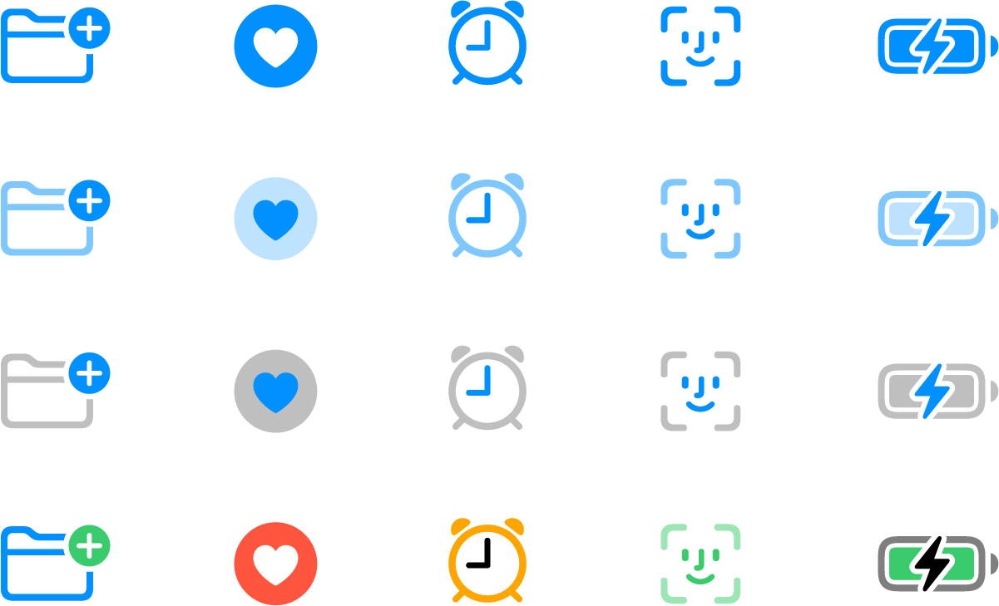

# Iconography

Apple apps will utilise Apple’s[ SF Symbols](https://developer.apple.com/sf-symbols/) library, available for free for all iOS/iPadOS/macOS/watchOS/tvOS apps. The library has 3000+ icon variations

## Modifications

The SF Symbols library allows for 4 main modifications of icons: variation, colour, weight, and scale.

**Variation** — Icons include outlined or filled variants. All icons should be chosen to be filled in when possible. Icons that do not include a filled variant should not be used when not necessary. Using outline icons should only be used as a last resort.

**Colour** — The colour of icons fall under this design system’s [colour guide](colour.md), allowing the use of any of the system colours, pending contrast levels. Icons can be modified for 4 rendering types: `monochrome`, `hierarchical`, `palette`, and `multicolour`. These types can be chosen at the discretion of the designer but should be chosen with consistency and contrast in mind.

**Weight** — The weight of icons is standardised across all Apple apps. All icons should use `regular` `regular` weight, disregarding any inherit weights or accompanied typography weights.

**Scale** — The scale of icons changes the size in relation to any accompanying text (e.g. buttons). The scale should always be set as `medium`, unless specifically important. The sizing of icons and any accompanying text falls under this design system’s [typography guide](typography.md).
